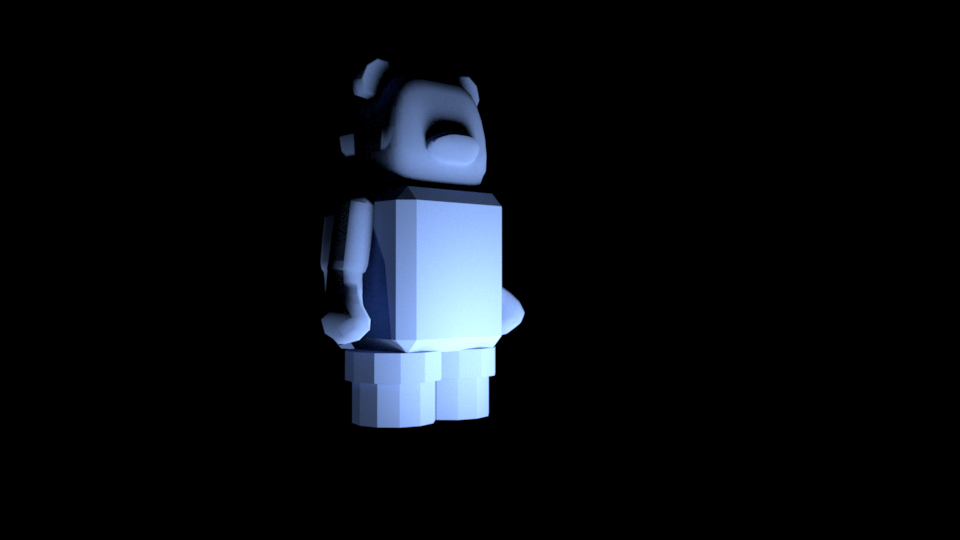

# Example Creations!
_Created by UCBUGG Facilitators_

_Jacob Holesinger and EJ Zamora_

_Alex Hong_

# Creating the 3D Model with Autodesk Maya 
## 1. Model the head
Start with a basic cube  
Reduce to 0 subdivisions  
Scale down top face, tapered head shape (bigger on the bottom)  
Use ‘3’ key to preview smooth mode  
Add edges, along the z-axis and x-axis but not around the y-axis  
Loops towards the existing edges  
If looking at the top face, put in edge loops that go horizontally and vertically, twice towards existing edges  
‘Mesh display → Soften edges’ (Maya preview only)  
## 2. Model the snout
Take bottom four faces for snout, extruding them outwards  
Grab bottom vertices and push them inwards  
Move snout slightly higher  
Insert edge loop around snout to emphasize edges (less curved)  
‘Mesh → Smooth’ again by one subdivision level  
## 3. Model the ears
Start with a basic sphere  
Turn down to 12 subdivisions  
Grab top third of faces, ‘flatten’ by scaling down  
Shrink slightly along either x-axis or y-axis (along circular perspective)  
Make into ellipsoidal or oblong shape  
Ctrl-D duplicate and move both ears to the top of the head  
## 4. Model the torso
Create cube and place underneath head, slightly outwards in front of head  
Add smaller cube on upper area of torso  
Select all edges and ‘Edit Mesh → Bevel’  
## 5. Model the arms
Create a cube and scale it to be the size of the bears forearm (flatten and lengthen)  
Bevel top and bottom edge   
Extrude the bottom face to create forearm  
Extrude again at an angle to create the the hand  
Insert edge loop on hand and move to arch hand  
Insert edge loops to better define joints.  
## 6. Model the legs
For each leg, stack two short cylinders  
Slightly larger cylinder on top, smaller on the bottom  
Combine the multiple objects into one mesh  
Box select all different objects  
‘Mesh → [Combine] Combine’  
Auto UV Map the mesh  
(Optional) ‘Workspace → UV Editing’  
‘UV -> [Create] Automatic’  
## 7. Export the mesh as an FBX
Make sure fbx plugins are enabled  
Go to ‘Windows → Settings/Preferences → Plug-in Manager’  
Search for ‘fbx’  
Make sure that all results have ‘Load’ and ‘Auto Load’ checkmarked  
With bear selected, go to ‘File -> Export Selection’  
For ‘files of type’ change from ‘Maya Binary’ to ‘FBX export’  

# Creating the textures with Substance Painter
## 1. Start a new project
‘File → New’  
Template: ‘Unity 5 (allegorithmic)’  
File: ‘Select…’ → Choose the exported FBX bear  
Document Resolution: ‘2048’ (‘1024’ should also be fine)  
‘Ok’  
## 2. Give the bear a base color color coating
In the ‘LAYERS’ panel, choose the icon with a paint bucket and plus sign to ‘Add a fill layer’  
In the ‘PROPERTIES - FILL’ panel, click on the gray bar underneath ‘Base Color (uniform color)’  
Change to desired color (maybe light blue?), or use color picker  
### Rotate 3D model using “option/alt/windows” + drag, zoom with two fingers or scroll wheel, “command + option” or drag middle mouse to pan
## 3. In the ‘SHELF’ window, change from ‘Materials’ to ‘Brushes’ in the sidebar
Choose a brush type (e.g. ‘Basic Hard’)  
## 4. Workflow for painting:
Add a new fill layer  
Change base color to desired color  
For selected layer, add mask → ‘Add black mask’  
Adjust size and attributes to your liking  
Draw on bear  
Use ‘Mirror Z’ if desired  
## 5. Have fun!

**Bold** and _Italic_ and `Code` text

[Link](url) and 
